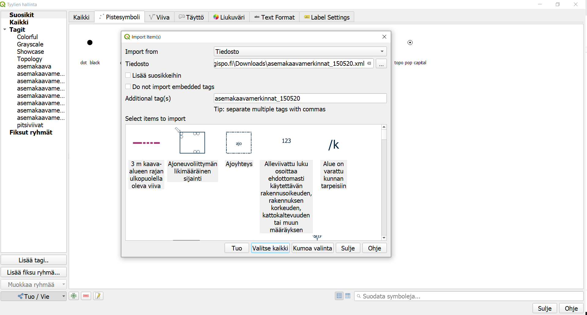
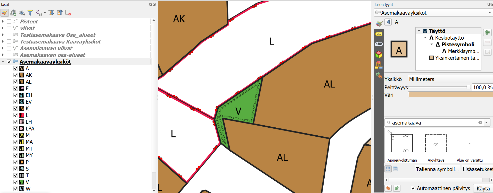

# Asemakaavan kuvaustekniikka

Asemakaavan kuvaustekniikka tuotetaan yhteistyössä QAAVA-kehitysprojektiin osallistuneiden toimijoiden kanssa. 
Sen on rahoittanut [Kuntaliitto](https://www.kuntaliitto.fi/ajankohtaista/2020/avoin-tyylikirjasto-helpottaa-asemakaavojen-digitalisointia?fbclid=IwAR3d_moQRJR0IxAxzJXxjlo4YtGfzT4ju87H8DTurRdNXtqo7FvnMIFkCUA). Kuvaustekniikka pohjautuu MRL:n asemakaavan visualisointioppaaseen (Ympäristönministeriö, 2003). Kuvaustekniikka tuotetaan nyt QML ja SLD-muodossa. Näin kuvaustekniikkaa voidaan käyttää QGISissä sekä esimerkiksi GeoServerillä. Toteutus valmistuu toukokuussa 2020.

- [QGISin QML tiedosto](asemakaavamerkinnat.xml) (15.5.2020 versio 1.0)
- SLD-visualisointikirjasto (tulossa)
- [Testiaineisto GeoPackage-muodossa](Testiasemakaava.gpkg), siinä on valmiina QGIS projekti ja tyylikirjasto sisällä

## Ohjeet käyttöönottoon

1. Lataa XML-muotoinen tyylikirjasto koneellesi ja avaa QGIS. Kohdasta **Asetukset > Tyylien hallinta** avautuvassa paneelissa voit importoida (tuoda) XML-tyylin QGISiin. Valitse kaikki ja Tuo tiedot. 

2.  Käytä omaa aineistoa ja luokittele aineistosi QGISin tason tyylit-kohdassa. Määrittele haluamallesi kohteille sopivat tyylit. Muista, että tyylikirjasto koostuu polygoneista, viivoista ja pisteistä. Pistemäiset tyylit *eivät* näy polygoneille ja toisinpäin. 

## Ohjeet datan määrittämien visualisointien käyttöön

Osa tyyleistä vaatii dataa taakseen, kuten esimerkiksi "korttelin numero" tai "rakennuksen julkisivun korkeus". Tähän kirjaamme ohjeet miten oman aineiston tietojen avulla voi määrittää visualisoinnin arvoja. Ohjeet tulossa.

## Taustatietona hyödynnetty
- [MRL:n opas asemakaavoitukseen, YM - Opas 12 Asemakaavamerkinnät- ja määräykset, 2003](https://www.ym.fi/fi-FI/Maankaytto_ja_rakentaminen/Lainsaadanto_ja_ohjeet/Maankaytto_ja_rakennuslaki_2000_sarja/Opas_12_Asemakaavamerkinnat_ja_maaraykse(4437))
- [Paimion asemakaavan SLD](paimion-asemakaavan-sld)
