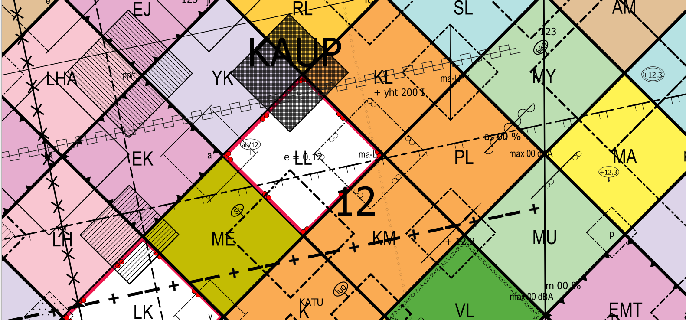
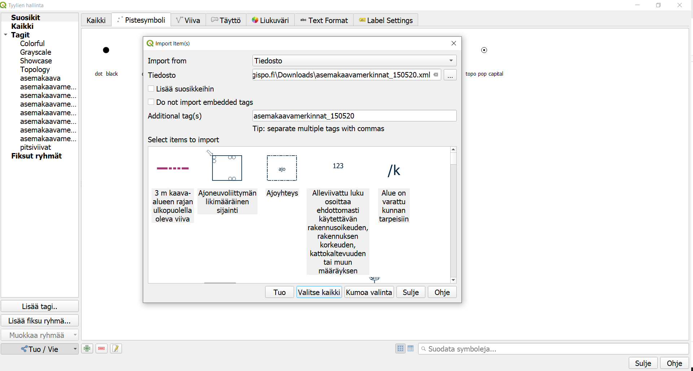
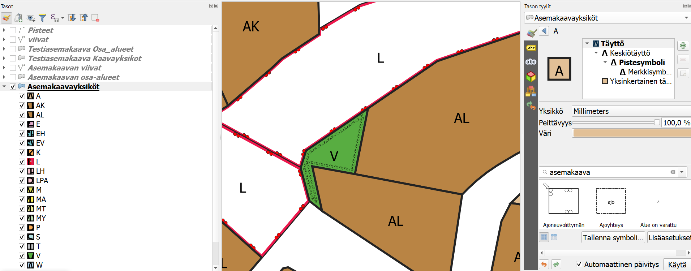
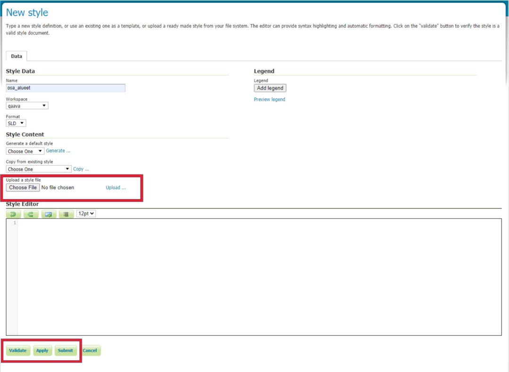

# Asemakaavan kuvaustekniikka

Asemakaavan kuvaustekniikka tuotetaan yhteistyössä QAAVA-kehitysprojektiin osallistuneiden toimijoiden kanssa. 
Sen on rahoittanut [Kuntaliitto](https://www.kuntaliitto.fi/ajankohtaista/2020/avoin-tyylikirjasto-helpottaa-asemakaavojen-digitalisointia?fbclid=IwAR3d_moQRJR0IxAxzJXxjlo4YtGfzT4ju87H8DTurRdNXtqo7FvnMIFkCUA). Kuvaustekniikka pohjautuu MRL:n asemakaavan visualisointioppaaseen (Ympäristönministeriö, 2003). Kuvaustekniikka tuotetaan QML- ja SLD-muodossa, jotta sitä voidaan käyttää sekä QGISissä että esimerkiksi GeoServerissä. Asemakaavan kuvaustekniikka valmistuu toukokuussa 2020.

- [XML-muodossa QGISin kuvaustyyli](asemakaavan_kuvaustekniikka.xml) (29.5.2020 versio 1.1)
- [SLD-kuvaustekniikka](SLD) (4.6.2020 versio 0.1)

- [QML eri tasoille](QML) - tehty testiaineistolle XML:n avulla (1.6.2020)
- [Testiaineisto GeoPackage-muodossa](asemakaava_testiaineisto.gpkg)
    - Testiaineistossa on mukana tyylikirjasto

## Ohjeet kuvaustekniikan käyttöönottoon QGISillä

HUOM! Kuvaustekniikka on tehty uusimmalla QGIS-versiolla (3.10 tai uudempi). Vanhoilla versioilla tyyli ei toimi, sillä aiempiin versioihin nähden tyylien määrittelyyn tullut huomattavasti muutoksia QGISissä.

1. Lataa asemakaavan kuvaustekniikan sisältävä XML-tiedosto tietokoneellesi ja avaa QGIS. Mene **Asetukset > Tyylien hallinta** niin saat auki **Tyylien hallinta -ikkunan**. Klikkaa ikkunan vasemmasta alakulmasta **Tuo/Vie > Import Item(s)** ja valitse tuotavaksi tiedostoksi lataamasi XML-tiedosto. Klikkaa **Valitse kaikki** ja sitten **Tuo** niin saat kuvaustekniikan QGISiin.

2. Käytä omaa aineistoa ja luokittele aineistosi QGISin **Kuvaustekniikka-paneelissa** (saat sen näkyviin menemällä **Näytä > Paneelit > Kuvaustekniikka**). Määrittele haluamallesi kohteille sopivat tyylit. Muista, että kuvaustekniikka koostuu polygoneista, viivoista ja pisteistä. Pistemäiset tyylit **eivät** näy polygoneille ja toisinpäin.

## Ohjeet SLD-kuvaustekniikan käyttöönottoon GeoServer-ohjelmistossa

Asemakaavan kuvaustekniikassa on käytetty standardimuotoista SLD-kuvaustekniikkaa, joten sen pitäisi toimia kaikilla kyseistä standardia tukevilla ohjelmistoilla. Kuvaustyylejä on testattu GeoServerillä, ja ohessa on ohjeet tyylien käyttämiseen kyseisellä ohjelmistolla.

HUOM! Oletuksena on, että GeoServerille tuotujen tasojen ominaisuustiedoista löytyy sarake **ak_merk**, joka määrittää kaavakohteen tyypin  MRL:n oppaan numeroinnin mukaisesti, ja jonka perusteella kohteiden tyylit määräytyvät. Käytännössä myös osaan kaavakohteista liittyy datasta määräytyviä arvoja (esim. tontin numero, meluvallin desibeliarvo jne.). Yhteinäisten attribuutti-nimitysten puuttuessa, nämä merkinnät on toteutettu oppaan merkintöjä jäljittelevinä esimerkkimerkintöinä, joskin ohjeet datasta määräytyvien arvojen käyttöön löytyvät alla olevasta luvusta.     

1. Lataa asemakaavan kuvaustekniikan sisältävät SLD-tiedostot tietokoneellesi. Tyylitiedostot on jaettu neljään eri tiedostoon kaavakohteen tyypin mukaisesti: 

- kaavayksiköt (MRL:n oppaan merkinnät 1-81), 
- osa-alueet (merkinnät 113-125, 127-128, 133-134, 136-138, 140-158, 161-162, 166-172, 174-183, 185-189) 
- viivamaiset kohteet (82-90, 126, 129-132, 135, 139, 159-160)
- pistemäiset kohteet (91-112, 163-165, 173, 184)

2. Kirjaudu GeoServerille. Oletuksena on, että visualisoitavat aineistot on jo sinne lisätty. Avaa päävalikon alta **Data**-valikosta kohta **Styles**. Tallenna GeoServerille uusi tyyli painamalla **Add New Style**. Aseta kohdan **Style Data** -kohdan alle perustiedot eli nimi tyylille (**Name**), mihin **Workspaceen** tyyli liitetään sekä varmista että kuvaustekniikan muotona (**format**) on SLD. Lataa koneelle tallentamasi tyylitiedosto kohdasta **Style Content** sekä **Choose File**. Tiedosto valittuasi muista myös painaa valintanapin oikealta puolelta **Upload...** (kts. kuva). **Validate**-napista voi tarkistaa ettei ladattu SLD sisällä virheitä sekä **Layer Preview** -välilehdeltä voi esikatsella tyyliä eri tasoilla. Paina **Submit** tallentaaksesi tyylin.

3. Ladatun tyylin voi asettaa oletustyyliksi halutulle tasolle **Publishing**-välilehdeltä ja laittamalla kyseiseselle tasolle ruksin **Default**-kohtaan. Tämän valinnan voi tehdä myös **Data**-valikosta kohdasta **Layers** ja valitsemalla sieltä halutun tason **Publishing**-välilehdeltä kohdasta **Default Style** ladattu tyyli.

## Ohjeet datan määrittämien visualisointien käyttöön

Osa tyyleistä vaatii dataa taakseen, kuten esimerkiksi "korttelin numero" tai "rakennuksen julkisivun korkeus". Tähän kirjaamme ohjeet miten oman aineiston tietojen avulla voi määrittää visualisoinnin arvoja. Ohjeet tulossa.

## Taustatietona hyödynnetty
- [MRL:n opas asemakaavoitukseen, YM - Opas 12 Asemakaavamerkinnät- ja määräykset, 2003](https://www.ym.fi/fi-FI/Maankaytto_ja_rakentaminen/Lainsaadanto_ja_ohjeet/Maankaytto_ja_rakennuslaki_2000_sarja/Opas_12_Asemakaavamerkinnat_ja_maaraykse(4437))
- [Paimion asemakaavan SLD](paimion-asemakaavan-sld)
