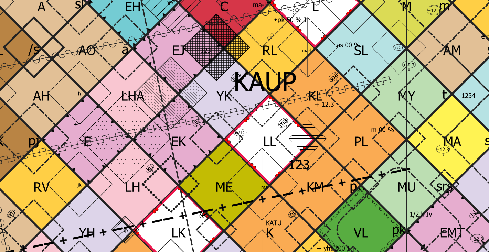

# Asemakaavan kuvaustekniikka

Asemakaavan kuvaustekniikka tuotetaan yhteistyössä QAAVA-kehitysprojektiin osallistuneiden toimijoiden kanssa. 
Sen on rahoittanut [Kuntaliitto](https://www.kuntaliitto.fi/ajankohtaista/2020/avoin-tyylikirjasto-helpottaa-asemakaavojen-digitalisointia?fbclid=IwAR3d_moQRJR0IxAxzJXxjlo4YtGfzT4ju87H8DTurRdNXtqo7FvnMIFkCUA). Kuvaustekniikka pohjautuu MRL:n asemakaavan visualisointioppaaseen (Ympäristönministeriö, 2003). Kuvaustekniikka tuotetaan QML- ja SLD-muodossa, jotta sitä voidaan käyttää sekä QGISissä että esimerkiksi GeoServerissä. Asemakaavan kuvaustekniikka valmistuu toukokuussa 2020.

- [QML-kuvaustekniikka](asemakaavan_kuvaustekniikka.xml) (15.5.2020 versio 1.0)
- SLD-kuvaustekniikka (tulossa)
- [Testiaineisto GeoPackage-muodossa](asemakaava_testiaineisto.gpkg)
    - Testiaineistossa on mukana QGIS-projekti ja tyylikirjasto

## Ohjeet kuvaustekniikan käyttöönottoon QGISillä

1. Lataa asemakaavan kuvaustekniikan sisältävä XML-tiedosto tietokoneellesi ja avaa QGIS. Mene **Asetukset > Tyylien hallinta** niin saat auki **Tyylien hallinta -ikkunan**. Klikkaa ikkunan vasemmasta alakulmasta **Tuo/Vie > Import Item(s)** ja valitse tuotavaksi tiedostoksi lataamasi XML-tiedosto. Klikkaa **Valitse kaikki** ja sitten **Tuo** niin saat kuvaustekniikan QGISiin.

2. Käytä omaa aineistoa ja luokittele aineistosi QGISin **Kuvaustekniikka-paneelissa** (saat sen näkyviin menemällä **Näytä > Paneelit > Kuvaustekniikka**). Määrittele haluamallesi kohteille sopivat tyylit. Muista, että kuvaustekniikka koostuu polygoneista, viivoista ja pisteistä. Pistemäiset tyylit **eivät** näy polygoneille ja toisinpäin.

## Ohjeet datan määrittämien visualisointien käyttöön

Osa tyyleistä vaatii dataa taakseen, kuten esimerkiksi "korttelin numero" tai "rakennuksen julkisivun korkeus". Tähän kirjaamme ohjeet miten oman aineiston tietojen avulla voi määrittää visualisoinnin arvoja. Ohjeet tulossa.

## Taustatietona hyödynnetty
- [MRL:n opas asemakaavoitukseen, YM - Opas 12 Asemakaavamerkinnät- ja määräykset, 2003](https://www.ym.fi/fi-FI/Maankaytto_ja_rakentaminen/Lainsaadanto_ja_ohjeet/Maankaytto_ja_rakennuslaki_2000_sarja/Opas_12_Asemakaavamerkinnat_ja_maaraykse(4437))
- [Paimion asemakaavan SLD](paimion-asemakaavan-sld)