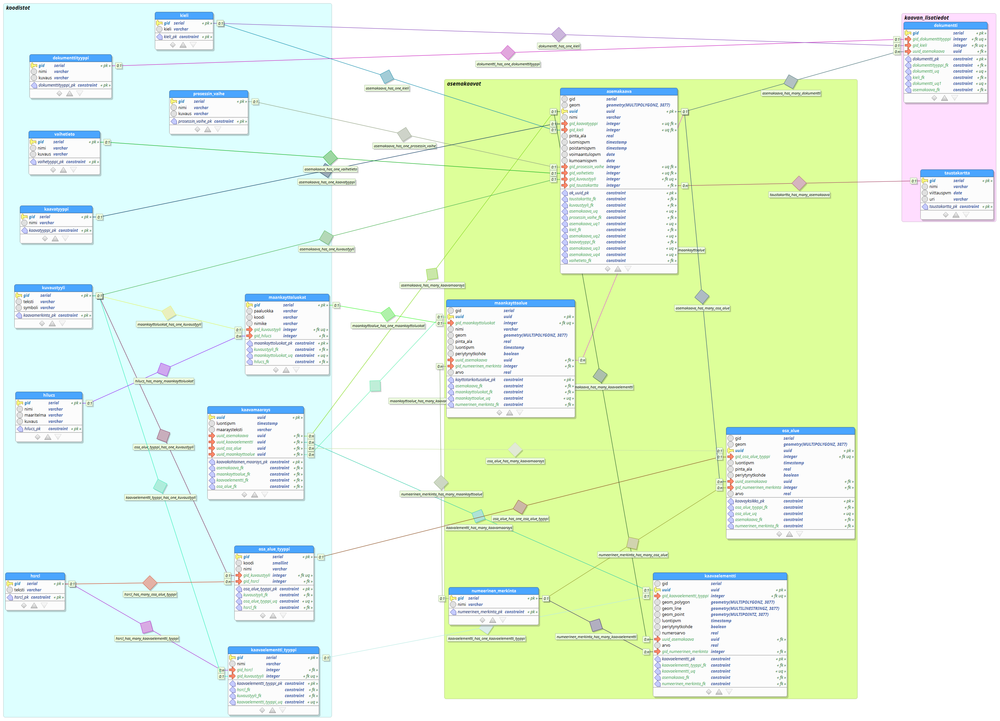
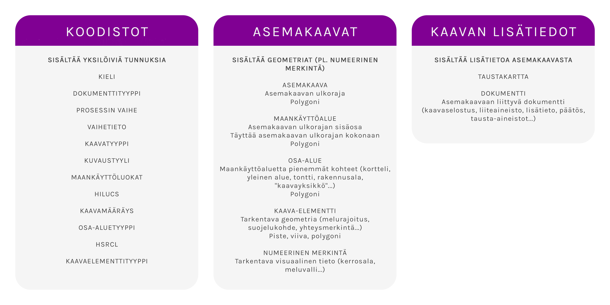

# Asemakaavan tietomalli

Asemakaavan tietomalli on tuotettu yhteistyössä QAAVA-kehitysprojektiin osallistuneiden toimijoiden kanssa. Toteutus valmis 12.6.2020, mutta siihen voi tulla muutoksia seuraavissa hankkeen vaiheissa. Koodilistat pyritään hakemaan suoraan kansallisista lähteistä jatkossa. 

Kehitysversiota on käyty läpi Paimion kaupungin kanssa.
- [Asemakaavan tietomalli - versio 1.0, dbm](tietomalli_luonnos.dbm) 12.6.2020
- [Asemakaavan tietomalli - versio 1.0, sql](tietomalli_luonnos.sql) 12.6.2020

## Tietomallin sisältö

- Toteutus on pyritty pitämään minimissä
    - Esimerkiksi kaavan lisätiedot (selosteet, dokumentit, päätökset, lähtötiedot) on kuvattu yhdessä taulussa
- Tietomalli sisältää **3 skeemaa**: koodistot, asemakaavat (sisältää kohteiden geometriat) sekä kaavan lisätiedot
- Mahdollista on, että tietomallia käyttävässä kunnassa halutaan laajentaa mallia omiin tarpeisiin ja se on okei
- Huomioitavaa on, että tietomalli tulee varmasti muuttumaan ajan kuluessa
    - Tämä pitää huomioida kun tietomallia alkaa käyttämään (ohjeistus päivitykseen tulossa)

### Koodistot-skeeman taulut

Sisältää koodilistoja, jotka voidaan liittää geometriaa sisältäviin kohteisiin tai kaavan lisätietotauluihin (osa listoista haettu suoraan YM:n tietomallista, jatkossa Suomi.fi-palvelun sanastosta). HILUCS ja HSRCL tulevat INSPIRE:n maankäyttöpäätösten koodilistalta, kansallisesti tehtävä määrittely mikä on mikäkin vastaavuus. HILUCSin osalta lista olemassa, HSRCL:n osalta ilmeisesti ei.

- *kaavamääräys*
- *kieli*
- *dokumenttityyppi*
- *prosessin_vaihe*
- *vaihetieto*
- *laavatyyppi*
- *kuvaustyyli*
- *maankäyttöluokat*
- *HILUCS*
- *osa_alue_tyyppi*
- *kaava_elementtityyppi*
- *HSRCL*
- *numeerinen_merkintätyyppi*: aputaulu, jolla voi kirjata numeerista tietoa (esim. rakennusala, tehokkuusluku). Jokaiselle numeeriselle tietotyypille voi antaa jonkin arvon. 

### Asemakaavat-skeeman taulut

Sisältävät asemakaavan paikkatietokohteet, eli geometriaa sisältävät taulut sekä numeeristen tietojen täyttöön aputaulun.

- *asemakaava:* kaavan ulkoraja, joka sisältää perustiedot kaavasta (nimi, prosessin vaihe, muokkauspäivämäärät...).
- *maankayttoalue:* kaavan ulkorajan sisälle jäävät maankäyttökohteet (kaavayksiköt) (esim. AP, V, LP jne), jotka ovat aina polygoneja (alueita). Nämä polygonit täyttävät koko kaava-alueen.
- *osa-alue:* voivat olla vain polygoneja ja ne ovat usein maankäyttöalueiden päällä "leijuvia" kohteita (esim. Rakennusala, jolle saa sijoittaa talousrakennuksen tai Pysäköimispaikka).
- *kaavaelementti:* voivat olla pisteitä, viivoja ja alueita (esim. Suojeltava puu, Harjasuunta, Ajoneuvoliittymän likimääräinen sijainti).

### Kaavan lisätiedot -skeeman taulut

Sisältää kaksi taulua, joissa kaavaan liittyviä tietoja. 

- *dokumentti:* erilaiset liitetiedostot, päätökset, lähtötiedot.
- *taustakartta:* virallinen kaavan taustakartta (linkki aineistoon tai lähteeseen).
- *numeerinen_lisätieto*: aputaulu, jokaiselle numeeriselle tietotyypille voi antaa jonkin arvon, nyt sallitaan kaikki merkinnät, sillä esim. kerrosluvuissa oli yhdistettynä roomalaisia numeroita, tekstiä ja numeroita. Jatkossa pohdittava miten näistä voidaan laskea tietoja ja halutaanko tehdä näin. 

## Tietomallin pohjana on käytetty seuraavia tausta-aineistoja ja selvityksiä:

- [INSPIRE: Planned Land Use](https://inspire.ec.europa.eu/data-model/approved/r4618-ir/html/index.htm?goto=2:3:10:1:4:8445)
- [Tampereen yleiskaava 2019-04](https://github.com/GispoCoding/Tampere-KDYK/blob/master/database_model/)
- [Ympäristöministeriön rakennetun ympäristön kaavatietomalli](https://github.com/YM-rakennettu-ymparisto/kaavatietomalli/blob/master/uml/Kaavoituksen_kansallinen_tietomalli_14062019.pdf)
- [Ympäristöministeriön tulevaisuuden maankäyttöpäätökset -hankkeen tulokset](http://julkaisut.valtioneuvosto.fi/handle/10024/162107)
- [Harmonisoidut maakuntakaavat e-palveluiksi -hankkeen tulokset](https://www.lounaistieto.fi/maakuntakaavat/)
- [Helsingin kaupungin KIRA-digi-hankkeen tulokset](https://www.avoindata.fi/data/fi/dataset/kiradigi_helsingin-asemakaavat-yhteisena-tietovarantona/resource/0e35451b-862e-4a1a-b3f9-15f03db7466b?inner_span=True)

Lisäksi siinä huomioidaan ympäristöministeriön käsitteistö, sanasto ja tietomallien kehitystyö. 
