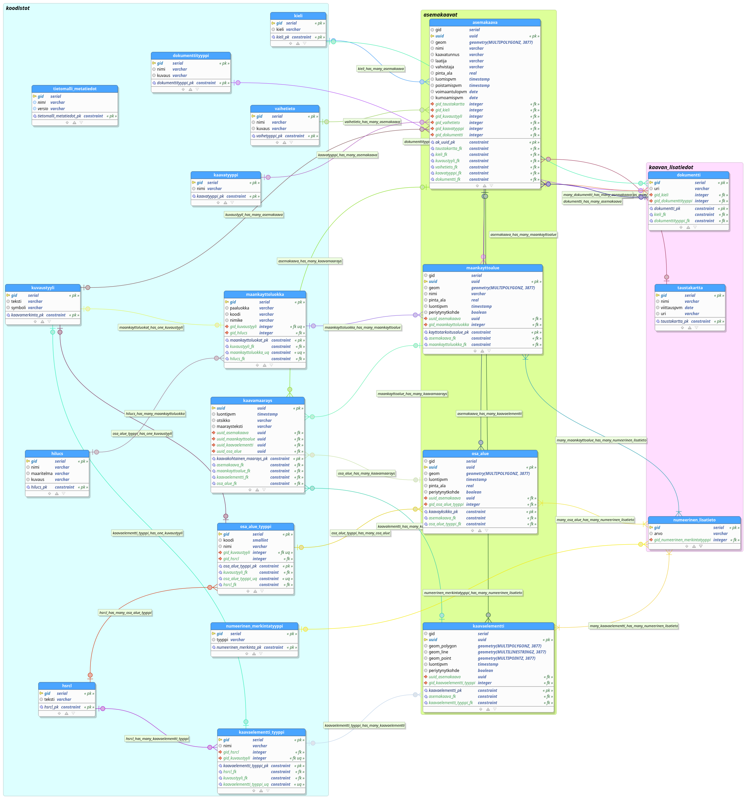

# Asemakaavan tietomalli

Asemakaavan tietomalli on tuotettu yhteistyössä QAAVA-kehitysprojektiin osallistuneiden toimijoiden kanssa. 

Ensimmäistä versiota on käyty läpi Paimion kaupungin kanssa.
- [Asemakaavan tietomalli - versio 0.1, dbm](tietomalli_luonnos.dbm)
- [Asemakaavan tietomalli - versio 0.1, sql](tietomalli_luonnos.sql)

Tietomallin pohjana on käytetty seuraavia tausta-aineistoja ja selvityksiä:

- [INSPIRE: Planned Land Use](https://inspire.ec.europa.eu/data-model/approved/r4618-ir/html/index.htm?goto=2:3:10:1:4:8445)
- [Tampereen yleiskaava 2019-04](https://github.com/GispoCoding/Tampere-KDYK/blob/master/database_model/2019-04-19-avoin_yleiskaava.png)
- [Ympäristöministeriön rakennetun ympäristön kaavatietomalli](https://github.com/YM-rakennettu-ymparisto/kaavatietomalli/blob/master/uml/Kaavoituksen_kansallinen_tietomalli_14062019.pdf)
- [Ympäristöministeriön tulevaisuuden maankäyttöpäätökset -hankkeen tulokset](http://julkaisut.valtioneuvosto.fi/handle/10024/162107)
- [Harmonisoidut maakuntakaavat e-palveluiksi -hankkeen tulokset](https://www.lounaistieto.fi/maakuntakaavat/)
- [Helsingin kaupungin KIRA-digi-hankkeen tulokset](https://www.avoindata.fi/data/fi/dataset/kiradigi_helsingin-asemakaavat-yhteisena-tietovarantona/resource/0e35451b-862e-4a1a-b3f9-15f03db7466b?inner_span=True)

Lisäksi siinä huomioidaan ympäristöministeriön pian käynnistyvä käsitteistö, sanasto ja tietomallien kehitystyö. 
