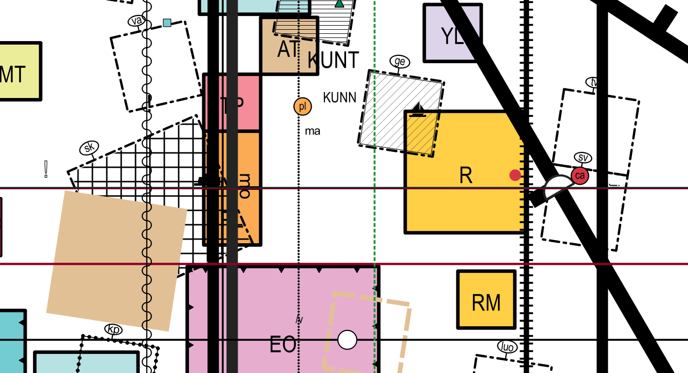

# Yleiskaavan kuvaustekniikka

Yleiskaavan kuvaustekniikka tuotetaan yhteistyössä QAAVA-kehitysprojektiin osallistuneiden toimijoiden kanssa. 
Sen on rahoittanut [Kuntaliitto](https://www.kuntaliitto.fi/ajankohtaista/2020/avoin-tyylikirjasto-helpottaa-asemakaavojen-digitalisointia?fbclid=IwAR3d_moQRJR0IxAxzJXxjlo4YtGfzT4ju87H8DTurRdNXtqo7FvnMIFkCUA). Kuvaustekniikka pohjautuu MRL:n Yleiskaavakaavamerkinnät
ja -määräykset-oppaaseen (Ympäristönministeriö, 2003). Kuvaustekniikka tuotetaan QML- ja SLD-muodossa, jotta sitä voidaan käyttää sekä QGISissä että esimerkiksi GeoServerissä. Yleiskaavan kuvaustekniikka valmistuu elokuussa 2020.

- [XML-muodossa QGISin kuvaustyyli (versio 1.1, 21.8.2020)](yleiskaavan_kuvaustekniikka.xml)
- [SLD-kuvaustekniikka](SLD)
- Testiaineisto tulossa

## Ohjeet kuvaustekniikan käyttöönottoon QGISillä

HUOM! Kuvaustekniikka on tehty uusimmalla QGIS-versiolla (3.10 tai uudempi). Vanhoilla versioilla tyyli ei toimi, sillä aiempiin versioihin nähden tyylien määrittelyyn tullut huomattavasti muutoksia QGISissä.

1. Lataa yleiskaavan  kuvaustekniikan sisältävä XML-tiedosto tietokoneellesi ja avaa QGIS. Mene **Asetukset > Tyylien hallinta** niin saat auki **Tyylien hallinta -ikkunan**. Klikkaa ikkunan vasemmasta alakulmasta **Tuo/Vie > Import Item(s)** ja valitse tuotavaksi tiedostoksi lataamasi XML-tiedosto. Klikkaa **Valitse kaikki** ja sitten **Tuo** niin saat kuvaustekniikan QGISiin.

2. Käytä omaa aineistoa ja luokittele aineistosi QGISin **Kuvaustekniikka-paneelissa** (saat sen näkyviin menemällä **Näytä > Paneelit > Kuvaustekniikka**). Määrittele haluamallesi kohteille sopivat tyylit. Muista, että kuvaustekniikka koostuu polygoneista, viivoista ja pisteistä. Pistemäiset tyylit **eivät** näy polygoneille ja toisinpäin.

## Ohjeet SLD-kuvaustekniikan käyttöönottoon GeoServer-ohjelmistossa

Yleiskaavan kuvaustekniikassa on käytetty standardimuotoista SLD-kuvaustekniikkaa, joten sen pitäisi toimia kaikilla kyseistä standardia tukevilla ohjelmistoilla. Kuvaustyylejä on testattu GeoServerillä, ja ohessa on ohjeet tyylien käyttämiseen kyseisellä ohjelmistolla.

HUOM! Oletuksena on, että GeoServerille tuotujen tasojen ominaisuustiedoista löytyy sarake **yk_merk**, joka määrittää kaavakohteen tyypin  MRL:n oppaan numeroinnin mukaisesti, ja jonka perusteella kohteiden tyylit määräytyvät. Käytännössä myös osaan kaavakohteista voi liittyä datasta määräytyviä arvoja. Yhteinäisten attribuutti-nimitysten puuttuessa, nämä merkinnät on toteutettu oppaan merkintöjä jäljittelevinä esimerkkimerkintöinä, joskin ohjeet datasta määräytyvien arvojen käyttöön löytyvät alla olevasta luvusta.     

1. Lataa yleiskaavan  kuvaustekniikan sisältävät SLD-tiedostot tietokoneellesi. Tyylitiedostot on jaettu neljään eri tiedostoon kaavakohteen tyypin mukaisesti: 

- aluevaraukset (MRL:n oppaan merkinnät x-xx), 
- osa-alueet (merkinnät xx-xx) 
- viivamaiset kohteet (xx-xx
- pistemäiset kohteet (xx-xx)

2. Kirjaudu GeoServerille. Oletuksena on, että visualisoitavat aineistot on jo sinne lisätty. Avaa päävalikon alta **Data**-valikosta kohta **Styles**. Tallenna GeoServerille uusi tyyli painamalla **Add New Style**. Aseta kohdan **Style Data** -kohdan alle perustiedot eli nimi tyylille (**Name**), mihin **Workspaceen** tyyli liitetään sekä varmista että kuvaustekniikan muotona (**format**) on SLD. Lataa koneelle tallentamasi tyylitiedosto kohdasta **Style Content** sekä **Choose File**. Tiedosto valittuasi muista myös painaa valintanapin oikealta puolelta **Upload...** (kts. kuva). **Validate**-napista voi tarkistaa ettei ladattu SLD sisällä virheitä sekä **Layer Preview** -välilehdeltä voi esikatsella tyyliä eri tasoilla. Paina **Submit** tallentaaksesi tyylin.

3. Ladatun tyylin voi asettaa oletustyyliksi halutulle tasolle **Publishing**-välilehdeltä ja laittamalla kyseiselle tasolle ruksin **Default**-kohtaan. Tämän valinnan voi tehdä myös **Data**-valikosta kohdasta **Layers** ja valitsemalla sieltä halutun tason **Publishing**-välilehdeltä kohdasta **Default Style** ladattu tyyli.

### Datan määrittämät visualisoinnit SLD:ssä

Kuten edellä on mainittu, osa kaavamerkinnöistä vaatii syötteen/inputin kaavakohteiden ominaisuustiedoista, ja tällaisten kohteiden kuvaustyylit on tehty MRL:n oppaan mukaisiksi esimerkinomaisiksi tyyleiksi, joissa kyseisten ominaisuuksien arvot ovat 123, ABC jne. SLD-tyylien rakenteessa tällaiset arvot liittyvät **Label**-tagiin, johon kyseinen oletusarvo on nyt siis asetettu. Kyseisen tagin sisälle on kuitenkin myös kirjoitettu koodia, jolla Label-tagiin voidaan lukea kohteiden ominaisuustiedoista tuleva arvo. Tähän tarkoitukseen on käytetty **PropertyName**-tagia ja sen saa käyttöön seuraavasti: 

- Koodi on oletuksena kommentoitu pois käytöstä (eli se on merkkien \<!-- ja \--> välissä). SLD-tiedostoa voi muokata kuten mitä tahansa tekstitiedostoa, eli avaa ensin kyseinen tiedosto esimerkiksi Notepad++-ohjelmalla tai GeoServerin Style Editoriin.

- Etsi tyylitiedostosta merkintä (eli siis **Rule**-tag), jonka arvojen haluat määrittyvän suoraan datasta. Merkinnät ovat tiedostossa numerojärjestyksessä ja esimerkiksi **Name**-tag **MRL_yk_100** tarkoittaa MRL:n oppaan yleiskaavamerkintää numero 100. Name-tagia seuraava **Title**-tag kertoo tämän myös sanallisesti. 

- Etsi kyseisen merkinnän Label-tag ja editoi merkkien \<se:Label> ja \</se:Label> välissä olevaa koodia. Poista oletusarvo (123 tai vastaava) ja poista myös PropertyName-tagin ympärillä olevat kommenttimerkit, eli \<!-- ja \-->. Kirjoita merkkien \<ogc:PropertyName> ja \</ocg:PropertyName> väliin ominaisuustieto-tekstin tilalle se tason ominaisuustietosarakkeen nimi, josta arvon pitäisi määräytyä. Tallenna muutokset.

## Taustatietona hyödynnetty
- [MRL:n opas yleiskaavoitukseen, YM - Opas 11 Yleiskaavakaavamerkinnät ja -määräykset 2003](https://www.ym.fi/fi-FI/Maankaytto_ja_rakentaminen/Lainsaadanto_ja_ohjeet/Maankaytto_ja_rakennuslaki_2000_sarja/Opas_11_Yleiskaavamerkinnat_ja_maaraykse(4466))
